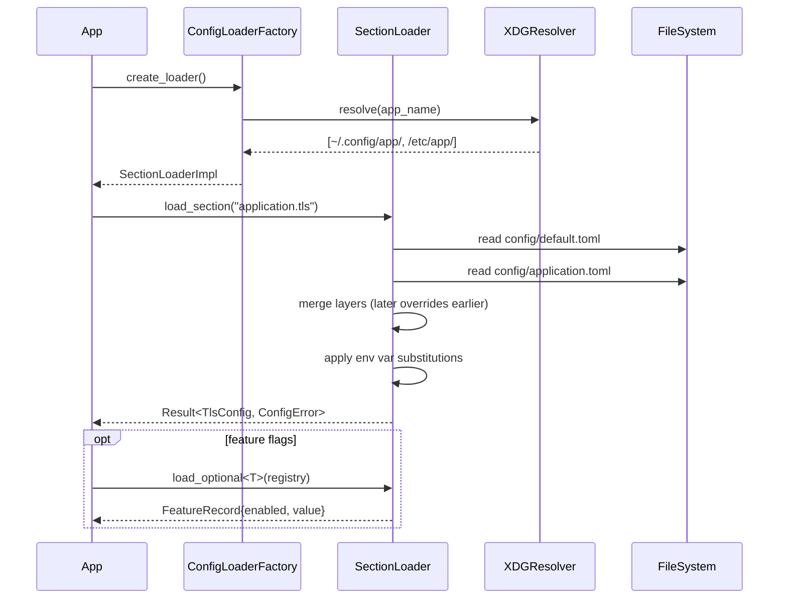
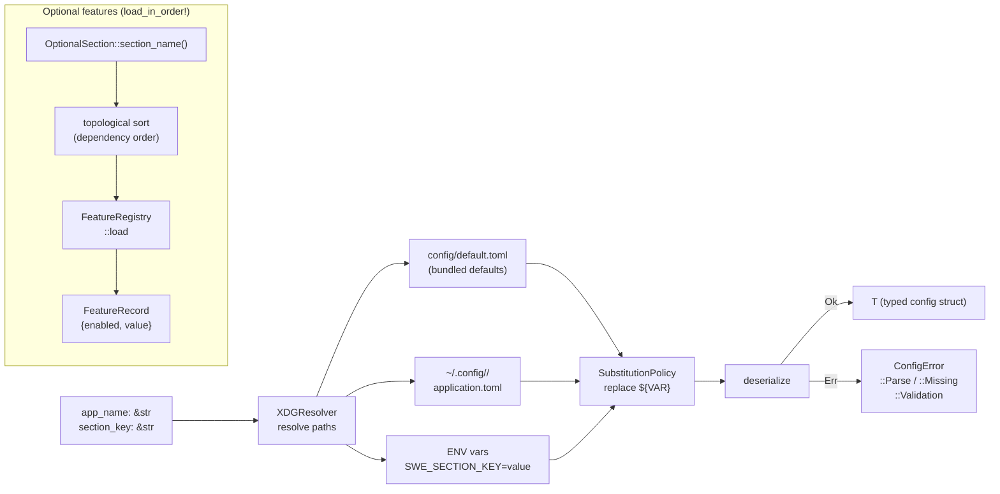

# Architecture — edge-configbuilder

## Sequence

> `ConfigLoaderFactory` resolves XDG paths at startup, merges the layer stack (defaults → application → env overrides), and returns a typed section to the caller.

## Data Flow

> A section key and `app_name` drive XDG path resolution; layered TOML files merge into a typed config struct.

