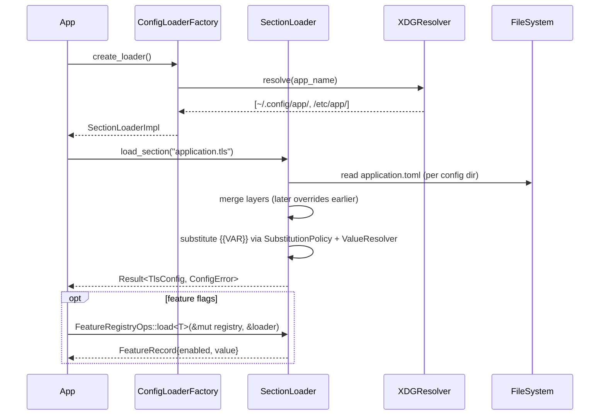
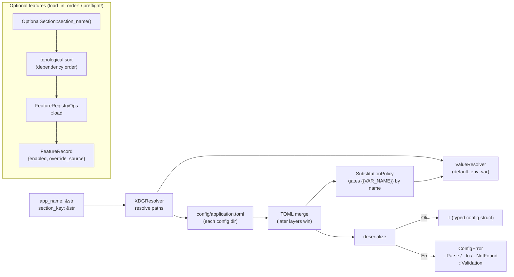

# Architecture — edge-configbuilder

## SEA module layout

Three layers: `api/` (declarations only — traits, DTOs/value objects, errors), `core/`
(implementation, `pub(crate)`, mirrors `api/`'s structure), and `saf/` (the facade —
`ConfigLoaderFactory` plus one `*_svc(_factory).rs` file per public trait/type). `api/` and
`core/` are never reached directly by consumers; every public path resolves through `saf/`.

```
main/src/
├── api/                          # contracts + value types (declaration only)
│   ├── configbuilder/{traits,vo}/
│   ├── loader/{traits,errors,dto,vo}/
│   ├── preflight/{traits,vo}/
│   ├── substitution/{error,traits,vo}/
│   └── validator/{traits,errors,vo}/
├── core/                         # implementation layer, mirrors api/ (pub(crate))
│   ├── configbuilder/
│   ├── loader/{errors,vo}/
│   ├── preflight/vo/
│   ├── substitution/{error,vo}/
│   └── validator/{errors,vo}/
└── saf/                          # facade — the only supported public entrypoint
    ├── configbuilder/factory.rs  # ConfigLoaderFactory
    └── *_svc(_factory).rs        # one marker + re-export pair per api/ trait or type
```

`api/*/dto/` holds the return types of envelope-pattern trait methods (`LoadedFeature`,
`RawFeature`); everything else value-like lives in `api/*/vo/`. Neither domain currently has
an `errors/`-eligible type outside the dedicated `errors/`/`error/` directories, nor an
`entity/`-eligible type (nothing with an `id` field or Repository-style usage).

## Sequence

> `ConfigLoaderFactory` resolves XDG paths at startup, merges the layer stack (defaults →
> application → env overrides), applies `{{VAR_NAME}}` substitution, and returns a typed
> section to the caller.


```mermaid
sequenceDiagram
    participant App
    participant ConfigLoaderFactory
    participant SectionLoader
    participant XDGResolver
    participant FileSystem

    App->>ConfigLoaderFactory: create_loader()
    ConfigLoaderFactory->>XDGResolver: resolve(app_name)
    XDGResolver-->>ConfigLoaderFactory: [~/.config/app/, /etc/app/]
    ConfigLoaderFactory-->>App: SectionLoaderImpl

    App->>SectionLoader: load_section("application.tls")
    SectionLoader->>FileSystem: read application.toml (per config dir)
    SectionLoader->>SectionLoader: merge layers (later overrides earlier)
    SectionLoader->>SectionLoader: substitute {{VAR}} via SubstitutionPolicy + ValueResolver
    SectionLoader-->>App: Result<TlsConfig, ConfigError>

    opt feature flags
        App->>SectionLoader: FeatureRegistryOps::load<T>(&mut registry, &loader)
        SectionLoader-->>App: FeatureRecord{enabled, value}
    end
```

## Data Flow

> A section key and `app_name` drive XDG path resolution; layered TOML files merge into a
> typed config struct.


```mermaid
flowchart LR
    A["app_name: &str\nsection_key: &str"] --> B["XDGResolver\nresolve paths"]
    B --> C["config/application.toml\n(each config dir)"]
    B --> E["ValueResolver\n(default: env::var)"]

    C --> F["TOML merge\n(later layers win)"]
    F --> S["SubstitutionPolicy\ngates {{VAR_NAME}} by name"]
    S --> E

    F --> G["deserialize<T:\nDeserializeOwned\n+ Default>"]
    G -->|Ok| H["T  (typed config struct)"]
    G -->|Err| I["ConfigError\n::Parse / ::Io / ::NotFound\n::Validation"]

    subgraph FeatureRegistry["Optional features (load_in_order! / preflight!)"]
        J["OptionalSection::section_name()"] --> K["topological sort\n(dependency order)"]
        K --> L["FeatureRegistryOps\n::load<T>"]
        L --> M["FeatureRecord\n{enabled, override_source}"]
    end
```

## Key contracts

| Type | Role |
|------|------|
| `ConfigLoaderFactory` | SAF entry point — every `create_*` constructor and delegated operation |
| `ConfigBuilder` / `BuilderFinalizer` | Fluent builder chain — accumulates name/version/dirs, finalises into a `Loader` |
| `Loader` / `LoaderOps` | Loads a typed TOML section by dotted key; validates configured dirs |
| `OptionalSection` / `FeatureRegistryOps` | Optional, dependency-ordered feature sections with graceful degradation |
| `SubstitutionPolicy` | Gates *which* `{{VAR_NAME}}` names may be substituted |
| `ValueResolver` | Resolves an allowed name to its value — `EnvValueResolver` by default, pluggable for secrets backends |
| `Preflight` / `PreflightReportOps` | Dry-run every feature section, collecting all issues before startup completes |
| `Validator` / `ValidatorOps` | Checks that a config path is a directory, not a file |
| `ConfigError` | `Parse` — malformed TOML; `Io` — filesystem/traversal error; `NotFound` — no `application.toml`; `Validation` — cross-field/dependency failure |

## Error semantics

| Error | Condition |
|-------|-----------|
| `ConfigError::NotFound` | No `application.toml` found in any configured directory |
| `ConfigError::Io` | Path is a file not a directory; `..` traversal in env var; file exceeds 1 MiB; substitution failure |
| `ConfigError::Parse` | `application.toml` (or a section within it) is not valid TOML |
| `ConfigError::Validation` | Dependency cycle, missing required dependency, or `validate_enabled` rejection |

`Ok(T::default())` is returned when `application.toml` exists but the requested section key
is absent — this is intentional optional config, not misconfiguration.
